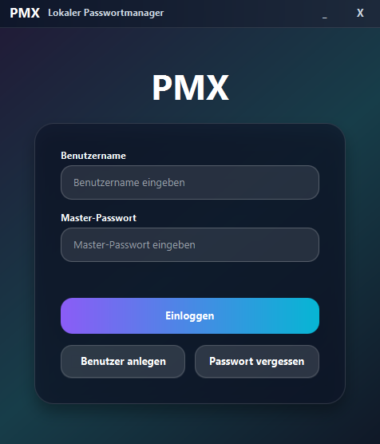
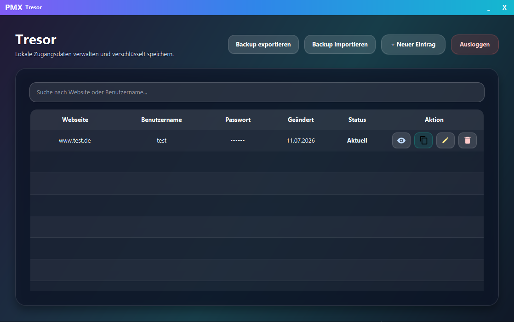
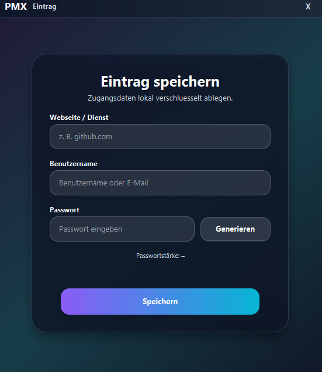
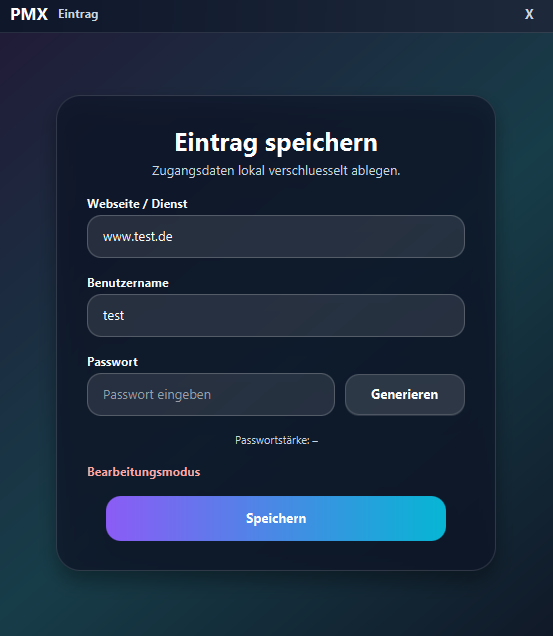
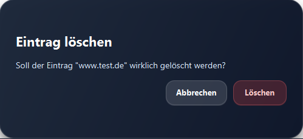

# PMX - Lokaler Passwortmanager

Ein lokaler Offline-Passwortmanager, entwickelt mit **Java**, **JavaFX**, **SQLite** und **NitriteDB**.

> **Hinweis:** Dieses Repository ist ein Demo- und Bewerbungsprojekt. Es enthält keine produktiven Benutzerdaten, keine echten Zugangsdaten und keine sensiblen lokalen Datenbanken.

## Ãœberblick

PMX wurde im Rahmen meiner Umschulung zum **Fachinformatiker für Anwendungsentwicklung** entwickelt.

Ziel war die Umsetzung eines lokalen Passwortmanagers mit Fokus auf **Sicherheit**, **Offline-Betrieb** und **klarer Benutzerführung**. Die Anwendung speichert Zugangsdaten lokal, verschlüsselt sensible Daten und verzichtet bewusst auf Cloud-Synchronisierung.

## Funktionen

- Benutzerregistrierung und Login
- Lokale, verschlüsselte Speicherung von Zugangsdaten
- Passwortgenerator
- Recovery-Funktion
- Übersichtliche Tresoransicht für gespeicherte Einträge
- Suche nach Website oder Benutzername
- Einträge hinzufügen, bearbeiten und löschen

## Technologien

- Java 17
- JavaFX
- Maven
- SQLite
- NitriteDB
- JUnit 5

## Sicherheitskonzept

- **AES-256-GCM** zur Verschlüsselung sensibler Daten
- **PBKDF2-HMAC-SHA-256** zur Schlüsselableitung
- Trennung von Benutzerverwaltung und Tresordaten
- Keine Speicherung produktiver Daten im Repository
- Lokaler Betrieb ohne externe Synchronisierung

## Projekt lokal starten

### Voraussetzungen

- Java 17
- Maven
- IntelliJ IDEA oder eine andere Java-IDE

### Start

1. Repository klonen:

   ```bash
   git clone https://github.com/n-somas/pmx-password-manager.git
   ```

2. In den Projektordner wechseln:

   ```bash
   cd pmx-password-manager
   ```

3. Maven-Abhängigkeiten laden:

   ```bash
   mvn clean install
   ```

4. Anwendung starten:

   ```bash
   mvn javafx:run
   ```

### Tests ausführen

```bash
mvn test
```

## Screenshots

### Login und Tresor

<p>
  
</p>

<p>
  
</p>

### Einträge verwalten

<p>
  
  
</p>

### Löschen-Dialog

<p>
  
</p>

## Autor

**Niloshan Somasundaram**
