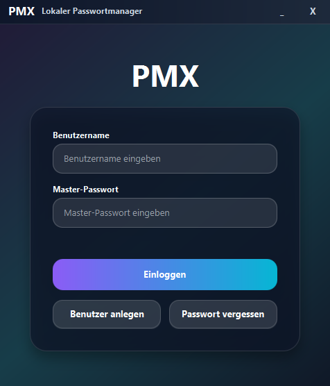
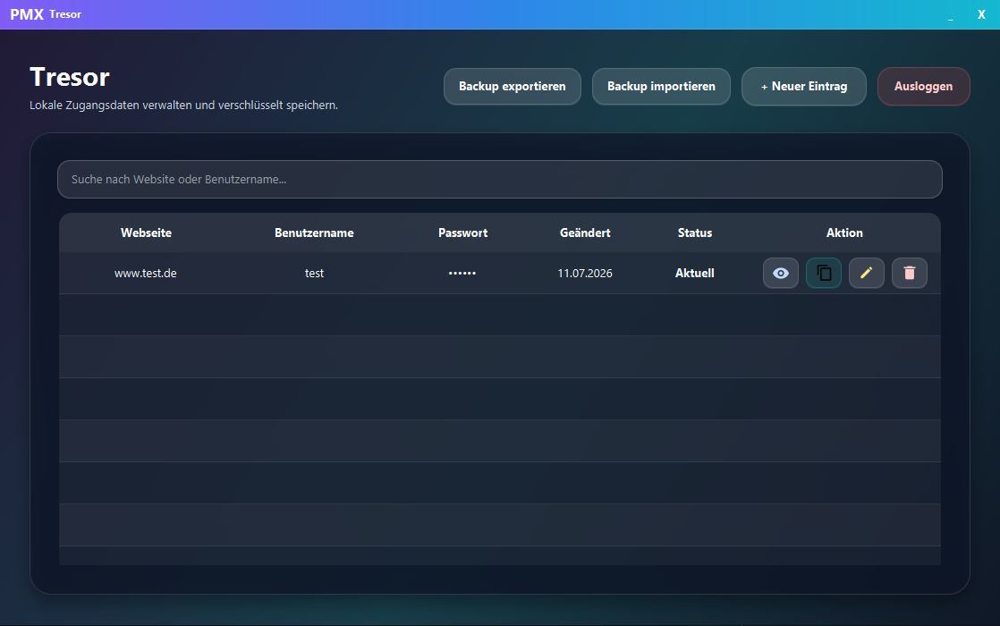
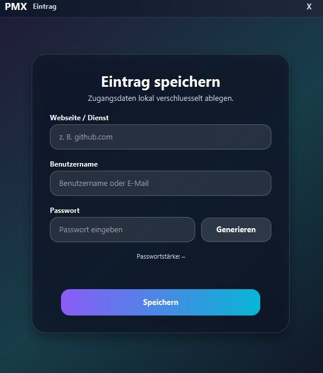
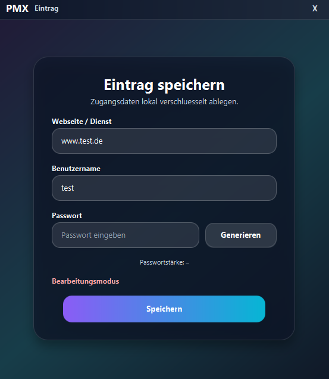
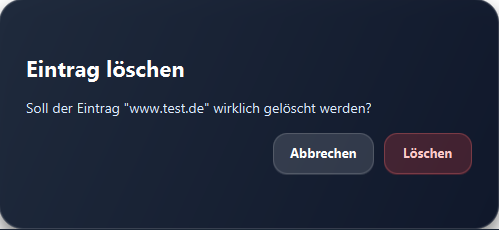

# PMX - Local Password Manager

[](https://github.com/n-somas/pmx-password-manager/actions/workflows/maven.yml)

**PMX** is a local, offline password manager built as a JavaFX desktop application. The project combines Java, JavaFX, local data persistence, encryption, authentication, backup handling, automated tests, and desktop UI development in one complete application.

> **Note:** This repository is a portfolio and demonstration project. It contains no production user data, real credentials, or sensitive local databases.

## Project Focus

* Local desktop application without cloud synchronization
* JavaFX user interface with a custom dark PMX design
* Encrypted storage of sensitive credentials
* User registration, login, and master-password recovery
* Vault view with search, create, edit, and delete operations
* Security-oriented features such as temporary password reveal, automatic clipboard clearing, password-age indicators, encrypted backups, and automatic vault locking

## Screenshots

### Login

<p>
  
</p>

### Vault

<p>
  
</p>

### Manage Entries

<p>
  
  
</p>

### Delete Dialog

<p>
  
</p>

## Features

* Create local user accounts and authenticate users
* Store credentials locally
* Search, add, edit, and delete vault entries
* Generate passwords for new credentials
* Recover and reset the master password
* Keep user data and vault data separated
* Track modification timestamps for each entry
* Evaluate password age using `Current`, `Review`, and `Old` states
* Reveal passwords only for a limited amount of time
* Copy passwords to the system clipboard
* Automatically clear copied passwords from the clipboard
* Export encrypted backups
* Import encrypted backups
* Automatically lock the vault after inactivity
* Temporarily block login after repeated failed attempts
* Display an empty-vault state with a direct shortcut for creating the first entry

## Security Design

PMX was designed around several basic security principles relevant to local credential storage.

* **AES-256-GCM** is used to encrypt sensitive vault data
* **PBKDF2-HMAC-SHA-256** is used for key derivation
* Data remains local and is not synchronized to external services
* Production credentials and local databases are not stored in the repository
* Revealed passwords are automatically masked again after a short period
* Copied passwords are removed from the clipboard after 20 seconds if the clipboard still contains exactly that password
* Password-age metadata helps identify credentials that may require review
* Backup files are encrypted rather than exported as readable plaintext
* Automatic locking closes the vault after inactivity and removes the active session key
* Repeated failed login attempts trigger a temporary lockout

## Technical Details

### Entry Metadata

Each vault entry stores metadata such as:

```text
createdAt
updatedAt
passwordChangedAt
```

This allows PMX to distinguish between a general entry modification and an actual password change.

### Password Age Status

The password-age status is calculated from `passwordChangedAt`:

```text
Current = password was changed recently
Review  = password should be reviewed
Old     = password has not been changed for a longer period
```

The feature is intentionally lightweight but demonstrates how credential metadata can support security-oriented user guidance.

### Temporary Password Reveal

When the user chooses to reveal a password, PMX decrypts it and shows it only for a short period. After the timer expires, the table view is masked again automatically.

### Clipboard Protection

When a password is copied, PMX places it in the system clipboard. After 20 seconds, the application checks whether the clipboard still contains exactly the copied password. Only then is the clipboard cleared, preventing unrelated clipboard content from being removed accidentally.

### Encrypted Backups

PMX can export and restore vault entries through an encrypted backup format. Backup data is not stored as readable plaintext.

```text
PMX-BACKUP-1
<encrypted backup data>
```

During import, the backup is decrypted and validated before entries are added or existing entries are updated.

### Login Protection

PMX tracks failed login attempts during the active session. After repeated failures, login is temporarily blocked and the login button is disabled. This implements a basic rate-limiting mechanism against repeated authentication attempts.

## Architecture

PMX separates user-interface code from application and security logic:

```text
JavaFX UI / FXML
       |
       v
Controllers
       |
       v
Service Layer
       |
       +--> EncryptionUtil
       +--> BackupService
       +--> DatabaseHelper
       |
       v
Local databases and encrypted vault data
```

FXML files define the interface, controllers handle user interactions and window logic, and security-sensitive functionality such as encryption and backup processing is separated into dedicated utility and service classes.

## Tech Stack

* Java 17
* JavaFX 21
* FXML
* CSS
* Maven
* SQLite
* NitriteDB
* Gson
* JUnit 5
* Git and GitHub

## Run Locally

### Requirements

* Java 17 or newer
* Maven
* IntelliJ IDEA or another Java IDE

### Clone the Repository

```bash
git clone https://github.com/n-somas/pmx-password-manager.git
cd pmx-password-manager
```

### Run the Tests

```bash
mvn clean test
```

### Start the Application

```bash
mvn javafx:run
```

## Version

Current release: `v1.0.0`

Version `v1.0.0` represents the current stable feature set of the portfolio project.

## Project Status

PMX is a completed portfolio and learning project focused on Java desktop development, local persistence, encryption, authentication, UI design, testing, and technical documentation.

It is **not a security-audited production password manager**. A production-grade credential manager would require substantially more security review, hardening, testing, key-management analysis, threat modeling, and independent auditing.

## Author

**Niloshan Somasundaram**
